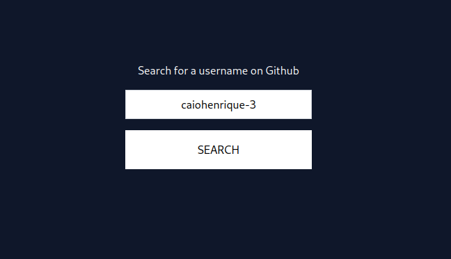

# GitHub Profile Checker

This mini-project lets you enter a username and instantly retrieve the
associated profile image, name, bio, and a direct link to the user's GitHub
profile. I created it because I wanted some exercises in API fetching, form
handling, and Tailwind CSS.

## Preview

## Running on your machine

To run this project locally, follow these steps:

1. Clone the repository
   (`git clone https://github.com/caiohenrique-3/github-profile-checker.git`)

2. Navigate to the project directory (`cd github-profile-checker`)

3. Install dependencies (`npm install`)

4. Start the development server (`npm run dev`)

The project will be accessible at http://127.0.0.1:8080.

## License

This project is licensed under the [MIT License](LICENSE).

---
